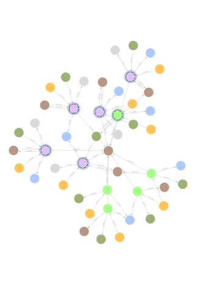

# 🎬 Modelagem de Dados em Grafos de um Serviço de Streaming

Este projeto demonstra como modelar um **grafo de conhecimento** para um serviço de streaming de filmes e séries, utilizando **Neo4j**.  
O foco está nos **relacionamentos** entre entidades, permitindo criar um sistema de recomendação poderoso.

---

## 🧩 Entidades (Nós)

- **User** → Usuários da plataforma
- **Movie** → Filmes
- **Series** → Séries
- **Genre** → Gêneros (Drama, Sci-Fi, Romance, etc.)
- **Actor** → Atores/Atrizes
- **Director** → Diretores

---

## 🔗 Relacionamentos

- **WATCHED** → `(User)-[:WATCHED {rating, year}]->(Movie/Series)`
- **ACTED_IN** → `(Actor)-[:ACTED_IN]->(Movie/Series)`
- **DIRECTED** → `(Movie/Series)-[:DIRECTED]->(Director)`
- **IN_GENRE** → `(Movie/Series)-[:IN_GENRE]->(Genre)`

---

## 🚀 Como rodar no Neo4j Aura

1. Crie um banco no [Neo4j Aura](https://console.neo4j.io).
2. Copie o conteúdo do arquivo `Neo4j-Stream.txt`.
3. Cole no **Query Editor** do Aura e execute.
4. Explore o grafo com `MATCH` e `RETURN`.

---

## 📊  Querie

